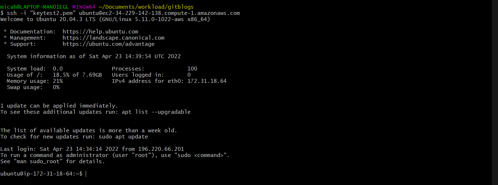

# Deploying a LEMP Stack Application On AWS Cloud

A LEMP Stack application is an application which as opposed to a [LAMP Stack Application](https://github.com/Micah-Shallom/Deploying_A_LAMP_Stack_Application_on_AWS_Cloud/blob/main/project.md, 'My github article on LAMP Stack deployment') makes use of Nginx as the web server for hosting the web application. NGINX is an open source software for web serving, reverse proxying, caching, load balancing, media streaming, and more.

## Creating an Ubuntu EC2 Instance
Create an AWS Cloud Service and create an Ubuntu EC2 instance. The virtual machine is a linux operating system which serves as the backbone for the LEMP Stack web application. 


Login into the instance via ssh:


## Installing Nginx

Run a `sudo apt update` to download package information from all configured sources.


`sudo apt install nginx`


Spin up the nginx server and ensure it automatically starts on system reboot by running the following commands
```
sudo systemctl start nginx
sudo systemctl enable nginx
```


