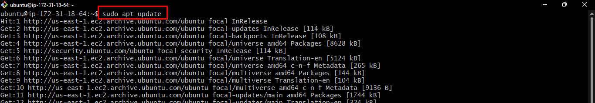

# Deploying a LEMP Stack Application On AWS Cloud

A LEMP Stack application is an application which as opposed to a [LAMP Stack Application](https://github.com/Micah-Shallom/Deploying_A_LAMP_Stack_Application_on_AWS_Cloud/blob/main/project.md, 'My github article on LAMP Stack deployment') makes use of Nginx as the web server for hosting the web application. NGINX is an open source software for web serving, reverse proxying, caching, load balancing, media streaming, and more.

## Creating an Ubuntu EC2 Instance
Login to AWS Cloud Service console and create an Ubuntu EC2 instance. The virtual machine is a linux operating system which serves as the backbone for the LEMP Stack web application. 


Login into the instance via ssh:


## Installing Nginx

Run a `sudo apt update` to download package information from all configured sources.



`sudo apt install nginx`


Spin up the nginx server and ensure it automatically starts on system reboot by running the following commands
```
sudo systemctl start nginx
sudo systemctl enable nginx
```
Run `systemctl status nginx` to check if the installation succeeds. A green text color shows that the server is active.


Accessing the default nginx web server block to see if everything works correctly. `curl` the local IP address of our local machine which in most case is `127.0.0.1` or the DNS name `localhost` on any web browser on our local machine.<br/> 
`curl http://127.0.0.1:80 or curl http://localhost:80`

The below result shows nginx has been properly set up and we can deploy our web application.


It appears our default nginx server is accessible locally on our local machine. To check if we can access the default server block over the internet on our local machine, insert the public IP address of the server a browser.


The search failed because there was no access to our nginx webserver over the internet even though we were using a public IP address. To correct this, we need to configure inbound security group rules for ubuntu ec2 instance on aws cloud.
**Enable TCP port 80**
